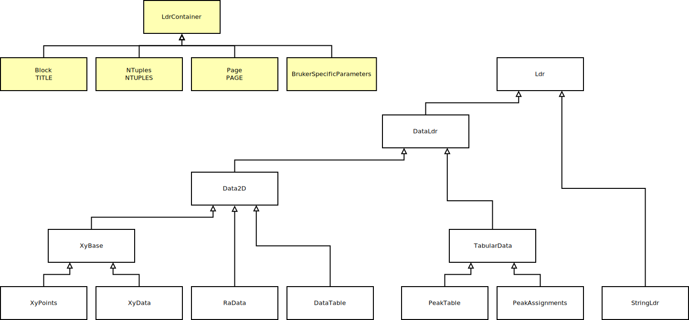

# jdx

Support for reading JCAMP-DX data.

## Details

This library allows to read data in the JCAMP-DX format ([jcamp-dx.org](http://www.jcamp-dx.org/)) with a focus on:
* [JCAMP-DX IR](http://www.jcamp-dx.org/protocols/dxir01.pdf)
* [JCAMP-DX NMR](http://www.jcamp-dx.org/protocols/dxnmr01.pdf)
* [JCAMP-DX MS](http://www.jcamp-dx.org/protocols/dxms01.pdf)

Several other flavors, e.g., for IMS and hypenated techniques should also work.

JCAMP-DX data is organized into so-called labeled data records (LDRs) that can hold data from simple strings to intricate multi-dimensional structures. Many special LDRs are fully supported, also see diagram below. If no special support is provided, the LDR value is treated as a string.

## Limitations

* There is no special support for technique specific LDRs (e.g., ACQUISITION TIME, COUPLING CONSTANTS, or IONIZATION MODE). Their values are treated as strings.
* No X value check is performed for (X++(Y..Y)) type data (relevant for for XYDATA, RADATA, and DATA TABLE LDRs). Instead, the abscissa values are derived exclusively from LDRs such as FIRSTX, LASTX, XFACTOR, NPOINTS or equivalent ones.
* No vendor specific extensions of the JCAMP-DX standard other than Bruker's are supported.
* [JCAMP-CS](http://www.jcamp-dx.org/protocols/dxcs01.pdf) is not supported.

## Inheritance diagram



## Example

```cpp
// open file
const std::string path{"path/to/data.jdx"};
auto istream = std::make_unique<std::ifstream>(path);

// Block is the root element in any JCAMP-DX data set
auto block = libjdx::jdx::JdxParser::parse(std::move(istream));

// get LDRs that are not specially treated
const auto& ldrs = block.getLdrs();

// optional
const auto& xyData = block.getXyData();
if (xyData)
{
    auto data = xyData.value().getData();
    for (const auto& xyPair : data)
    {
        std::cout << "x: " << xyPair.first << ", y: " << xyPair.second << "\n";
    }
}

```

## Sample data

Public sample data can be found at [JSpecView2](http://wwwchem.uwimona.edu.jm/spectra/JSpecView2/sample/).
